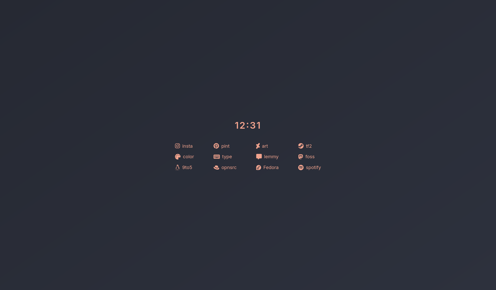

### Mnml startpage..

This project is a minimal homepage featuring a digital clock and a collection of categorized links to various websites.

**Key Features:**

* **Clock:** Displays the current time. Clicking it opens a blank "about:blank" page.
* **Font Awesome Icons:** Uses Font Awesome icons to visually represent each link.
* **Custom Styling:** Styled with a dark, minimalist theme using a subtle background gradient and a specific color palette. The layout is responsive, centering content on the page.

The HTML structures the content with a main container holding the clock and link sections. The CSS provides the visual styling, including the background, text colors, link appearance, and layout. A separate JavaScript file (`time.js`) handles the functionality of the clock.